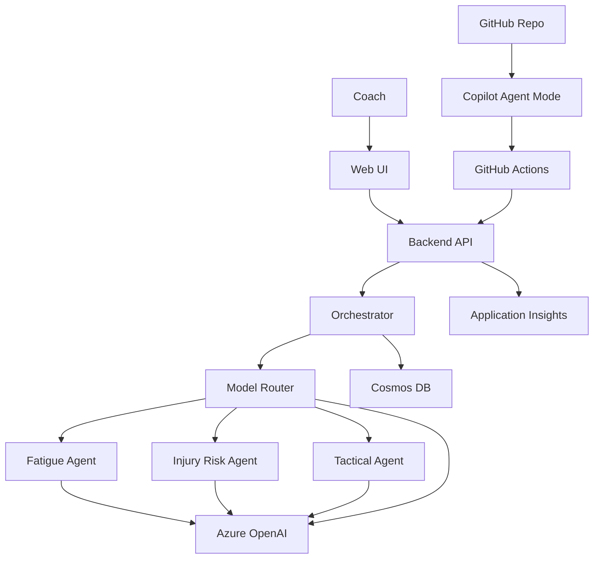

# tactIQ

## Live Demo


### AI Tactical Coach for Player and Match Decisions

tactIQ is a real-time AI tactical coach for cricket teams, analyzing player workload, fatigue, injury risk, and match context to recommend the optimal next move on the field.

For now tactIQ is built for cricket, but the system is designed to extend to multiple sports such as football, basketball, and other real time decision environments.

---

## What tactIQ Does

tactIQ helps captains and analysts answer key tactical questions

- Is the current player fit enough to continue  
- Should a substitution be made right now  
- Which player is most suitable for the current match context  
- How fatigue is impacting performance and injury risk  
- Whether the team is tactically on track or under pressure  

It converts match context and player state into coach like actionable guidance.

---

## Player Intelligence System

### Fatigue Awareness
- Real time fatigue increase and decrease controls  
- Performance impact simulation  
- Injury risk indication  

### Suitability Engine
- Evaluates whether a player should continue  
- Identifies when a player becomes tactically unfit  
- Suggests substitution scenarios based on fatigue and match pressure  

### Role Based Context
- Different logic for batters and bowlers  
- Tactical panels that adapt to the selected player role  

---

## Tactical Decision Support

- On track vs under pressure match states  
- Required vs current performance comparison  
- Projection awareness for decision timing  
- Substitution timing indicators  

The goal is not just to show numbers but to guide decisions.

---

## Tech Stack

- Frontend React + TypeScript + Vite  
- UI Components Radix UI + Tailwind CSS  
- Icons Lucide React  
- Backend Azure Functions
- Azure OpenAI 

---

## Use Cases

- Live tactical coaching support  
- Player workload management  
- Substitution decision systems  
- AI sports assistant platforms  
- Simulation and strategy tools  

---

## Run locally

This project runs with:

- **Backend (Express / Agent Framework):** http://localhost:8080  
- **Frontend (Vite):** http://localhost:5173  

---

## Install Dependencies

From the project root:

```bash
npm install
npm --prefix server/agent-framework install
```

---

## Configure Environment

Edit:

```
server/agent-framework/.env
```

Make sure it matches:

```env
AZURE_OPENAI_API_KEY=your_key
AZURE_OPENAI_ENDPOINT=https://tactiq-openai.openai.azure.com/
AZURE_OPENAI_DEPLOYMENT=gpt-4o-mini
AZURE_OPENAI_API_VERSION=2024-02-15-preview

PORT=8080

COSMOS_ENDPOINT=https://tactiq-cosmos.documents.azure.com:443/
COSMOS_KEY=your_key
COSMOS_DB=tactiq-db
COSMOS_CONTAINER=players
```

---

## Start Backend (API)

From project root:

```bash
node server.js
```

Backend will run on:

```
http://localhost:8080
```

---

## Start Frontend (Vite)

In a new terminal:

```bash
npm run dev
```

Frontend will run on:

```
http://localhost:5173
```

---

## Frontend API Configuration

In the root `.env` file (frontend environment):

```env
VITE_API_BASE_URL=http://localhost:8080
```

Restart Vite after changing environment variables.

---

## Manual Verification

Test API connectivity:

```bash
# Get baselines
curl http://localhost:8080/api/baselines

# Test orchestrate endpoint
curl -X POST http://localhost:8080/api/orchestrate \
  -H "Content-Type: application/json" \
  -d '{"context":{}}'
```

---

## Available Local API Endpoints

- `POST http://localhost:8080/api/orchestrate`
- `GET  http://localhost:8080/api/baselines`
- `POST http://localhost:8080/api/baselines`
- `DELETE http://localhost:8080/api/baselines/{playerId}`
- `POST http://localhost:8080/api/baselines/reset`

---

## Important Notes

- Do **not** run any other service on port `8080` while the backend is running.
- If you modify `.env`, restart the backend and frontend.
- Frontend calls backend via `VITE_API_BASE_URL`.


                                     ARCHITECTURE (tactIQ)
                   (Microsoft Foundry + Agent Framework + Azure Services + GitHub/Copilot)
```txt
┌──────────────────────────────────────────────────────────────────────────────┐
│ USERS (Coach / Analyst / Judges)                                             │
│ Web UI: Vite + React                                                        │
│  - Dashboard: Match context + Players + Signals                              │
│  - Controls: "Run Selected Agent" | "Run All Agents"                         │
│  - Output: Agent cards + Final Recommendation + Trace/Router info            │
└──────────────────────────────────────────────────────────────────────────────┘
                                   │ HTTPS
                                   ▼
┌──────────────────────────────────────────────────────────────────────────────┐
│ AZURE CLOUD                                                                  │
│                                                                              │
│  ┌───────────────────────────────┐        REST        ┌────────────────────┐ │
│  │ Azure App Service (Web/API)   │ ───────────────▶   │ Node.js/Express API│ │
│  │  - Hosts UI + API endpoints   │                    │  - Validates inputs │ │
│  │  - Public demo endpoint       │                    │  - Builds session   │ │
│  └───────────────────────────────┘                    │    context          │ │
│                                                       │  - Endpoints:       │ │
│                                                       │    /api/orchestrate │ │
│                                                       │    /api/agent/:name │ │
│                                                       └─────────┬──────────┘ │
│                                                                 │ invokes
│                                                                 ▼
│  ┌─────────────────────────────────────────────────────────────────────────┐ │
│  │ MICROSOFT AGENT FRAMEWORK (Agent Runtime + Tools)                        │ │
│  │  - Supervisor/Orchestrator Agent                                         │ │
│  │     • conversation state + routing policy                                │ │
│  │     • can run: single specialist OR full multi-agent pass                │ │
│  │  - Specialist Agents (callable tools)                                    │ │
│  │     1) Fatigue Agent  → workload + recovery drift                         │ │
│  │     2) Risk Agent     → injury/no-ball risk + alerts                      │ │
│  │     3) Tactical Agent → substitution + next-action recommendations        │ │
│  │  - Final Recommendation Synthesizer                                      │ │
│  │     • merges outputs into one decision + confidence + rationale           │ │
│  └───────────────────────────────┬─────────────────────────────────────────┘ │
│                                  │ model calls                              │
│                                  ▼                                          │
│  ┌─────────────────────────────────────────────────────────────────────────┐ │
│  │ MICROSOFT AI FOUNDRY (Azure AI Foundry / Azure OpenAI)                    │ │
│  │  - Model deployments + secure endpoints                                   │ │
│  │  - Policy/Router Layer (optional)                                         │ │
│  │     • intent detection                                                    │ │
│  │     • cost/latency-aware model choice                                     │ │
│  │     • safe fallback routing                                               │ │
│  └─────────────────────────────────────────────────────────────────────────┘ │
│                                                                              │
│  ┌─────────────────────────────────────────────────────────────────────────┐ │
│  │ AZURE COSMOS DB (Primary Data Store)                                      │ │
│  │  Stores:                                                                  │ │
│  │   - Baseline Player Model (active/inactive flags)                         │ │
│  │   - Rosters per team/match                                                │ │
│  │   - Match state snapshots (overs, wickets, partnerships, etc.)            │ │
│  │   - Agent runs + outputs (trace logs + structured results)                │ │
│  │   - Recommendations history + feedback (coach accept/reject)              │ │
│  │                                                                           │ │
│  │  Read/Write patterns:                                                     │ │
│  │   - UI → API: roster edits, run agent requests                            │ │
│  │   - API ↔ Cosmos: persist roster + match state + agent results            │ │
│  │   - Orchestrator/Agents: fetch context, write outputs + traces            │ │
│  └─────────────────────────────────────────────────────────────────────────┘ │
│                                                                              │
│  Response: JSON (agent cards + final decision + trace + saved run id)         │
└──────────────────────────────────────────────────────────────────────────────┘
                                   │
                                   ▼
┌──────────────────────────────────────────────────────────────────────────────┐
│ UI "ANALYSIS OUTPUT" PANEL                                                   │
│  - Shows router intent + signals                                              │
│  - Shows agent status: skipped / ok / fallback                                │
│  - Shows final recommendation + confidence                                    │
│  - Links: "View saved run" (Cosmos run id)                                    │
└──────────────────────────────────────────────────────────────────────────────┘

DEV + DELIVERY TOOLING (MICROSOFT + GITHUB)
┌──────────────────────────────────────────────────────────────────────────────┐
│ GitHub Repo                                                                   │
│  - Source code, issues, README, architecture diagram                          │
│ GitHub Actions (CI/CD)                                                        │
│  - Build + deploy to Azure App Service                                        │
│ GitHub Copilot                                                                │
│  - Assisted coding: UI, API endpoints, Agent Framework glue, tests, refactors │
└──────────────────────────────────────────────────────────────────────────────┘


````


#  System Flow

tactIQ is an AI tactical coaching system that runs a multi-agent analysis pipeline on live match context.  
It supports two execution modes:

- **Auto Mode (Model Router)** → runs only the required agents based on workload signals  
- **Run Full Analysis** → forces Fatigue, Injury Risk, and Tactical agents to run together for a complete coaching briefing  

Both modes follow the same core flow.

---

## 1. Coach Interaction (Web UI)

The coach:

- selects the **match state** (batting or bowling)  
- chooses players from the **roster**  
- can **add new players**, which automatically creates a baseline entry in **Azure Cosmos DB**  
- inputs workload, strain, and overs  

Each player stored in the roster has:

- baseline workload profile  
- recovery averages  
- fatigue limits  

This creates a **historical performance layer** used in future matches.

---

## 2. State Enforcement (Role Safety)

tactIQ validates match context before running AI:

- Running a **bowler in batting mode** triggers a notification to switch state  
- Running a **batter in bowling mode** does the same  
- Tactical recommendations are **role-safe**:
  - Bowling → suggests the next best bowler to rotate in  
  - Batting → suggests the next best batter  

This prevents invalid substitutions.

---

## 3. Backend Context Builder (Azure App Service)

The Node/Express API:

- validates match state  
- builds the session context  
- fetches player baselines from **Azure Cosmos DB**  
- computes:
  - workload accumulation  
  - strain trend  
  - recovery gap  
  - fatigue index  

---

## 4. Orchestrator (Agent Framework Pattern)

The orchestrator prepares a structured AI context containing:

- match situation  
- player role  
- overs remaining  
- workload trend  
- historical baseline  

This context is passed to the **Model Router**.

---

## 5. Model Router (Azure OpenAI)

In **Auto Mode**, the router decides which agents to run:

- **Fatigue Agent** → when workload or strain is high  
- **Injury Risk Agent** → when recovery deficit or overload is detected  
- **Tactical Agent** → always runs  

In **Run Full Analysis**, all agents execute regardless of thresholds.

The router outputs a deterministic execution plan.

---

## 6. Specialist Agents

### 🔵 Fatigue Agent
Analyzes:

- workload spikes  
- strain accumulation  
- recovery vs baseline  
- sleep deficit  

Outputs:

- fatigue level  
- rest recommendation  
- substitution urgency  
- **fatigue forecast graph** for upcoming overs

---

### 🔴 Injury Risk Agent
Identifies:

- probable injury type (e.g., hamstring overload, shoulder strain)  
- trigger factors  
- safe workload limits  

Outputs:

- risk level  
- recommended action:
  - continue  
  - rotate  
  - **mark unfit**

Also generates an **injury risk forecast curve** if the player continues.

---

### 🟡 Tactical Agent
Produces:

- match situation depiction  
- next best move  
- **which player to switch in** (role-safe)  
- context-aware strategy (rotate bowler, send aggressor, delay acceleration)

---

## 7. Player Management Actions

Based on agent output, the coach can:

- **Switch player** → AI suggests the optimal replacement  
- **Rest player** → removed from active state but workload preserved  
- **Mark unfit** → player locked from selection  

These actions update the session context while keeping historical baselines intact.

---

## 8. Forecast Visualizations

The UI displays:

- fatigue projection over the next overs  
- injury risk trend if the player continues  

This enables **proactive decision-making**, not reactive substitutions.

---

## 9. Data Layer (Azure Cosmos DB)

Stores:

- player baselines  
- historical workload  
- recovery trends  

Roster is session-based, but **every new player added persists to Cosmos DB**.

---

## 10. Observability (Azure Application Insights)

Tracks:

- router decisions  
- agent execution paths  
- latency and errors  
- analysis mode (auto vs full)

---

## 11. Copilot-Assisted DevOps

- **GitHub Copilot (Agent Mode)** → assisted UI, API, and orchestration code  
- **GitHub Actions** → CI/CD deployment to Azure App Service  

---

#  Execution Modes Summary

### Auto Mode
- Smart agent selection  
- Faster response  
- Runs only required analysis  

### Run Full Analysis
- Fatigue + Injury + Tactical together  
- Complete coaching briefing  
- Used for high-stakes decisions  

---

#  Outcome

tactIQ delivers:

- role-safe player switching  
- rest and unfit management  
- AI-driven substitution decisions  
- fatigue and injury forecasting  
- baseline-aware tactical intelligence  

All powered by a **multi-agent Azure architecture**.
