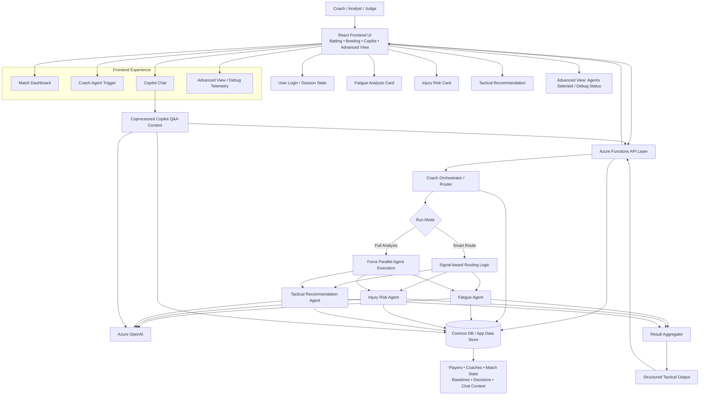
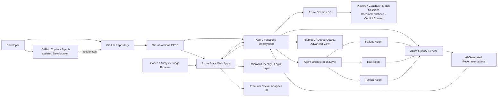

# tactIQ

## Live Demo

### AI Tactical Coach for Player and Match Decisions

tactIQ is a real-time AI tactical coach for cricket teams, analyzing player workload, fatigue, injury risk, and match context to recommend the optimal next move on the field.

For now tactIQ is built for cricket, but the system is designed to extend to multiple sports such as football, basketball, and other real time decision environments.

---

## What tactIQ Does

tactIQ helps captains and analysts answer key tactical questions

- Is the current player fit enough to continue  
- Should a substitution be made right now  
- Which player is most suitable for the current match context  
- How fatigue is impacting performance and injury risk  
- Whether the team is tactically on track or under pressure  

It converts match context and player state into coach like actionable guidance.

---

## Player Intelligence System

### Fatigue Awareness
- Real time fatigue increase and decrease controls  
- Performance impact simulation  
- Injury risk indication  

### Suitability Engine
- Evaluates whether a player should continue  
- Identifies when a player becomes tactically unfit  
- Suggests substitution scenarios based on fatigue and match pressure  

### Role Based Context
- Different logic for batters and bowlers  
- Tactical panels that adapt to the selected player role

tactIQ introduces a router based multi-agent architecture that dynamically selects specialized AI agents based on live match signals.
Instead of running a single model prompt, the system orchestrates fatigue analysis, injury risk assessment, and tactical reasoning agents to produce explainable coaching decisions.

---

## Tactical Decision Support

- On track vs under pressure match states  
- Required vs current performance comparison  
- Projection awareness for decision timing  
- Substitution timing indicators  

The goal is not just to show numbers but to guide decisions.

---
## Repository Notes

### Current primary architecture

- Frontend: React + Vite
- Hosting: Azure Static Web Apps
- Main backend API: Azure Functions under `/api`
- AI reasoning: Azure OpenAI
- Persistence: Azure Cosmos DB

### Archived experimental component

- `archive/agent-framework-experimental` contains an earlier Node/Express-based agent runtime explored during development and is not required for the main tactIQ web application flow.

 ### Current deployment
The current tactIQ web application is deployed using:

- **Azure Static Web Apps** for the frontend
- **Azure Functions** for the main API and orchestration layer

## Tech Stack

| Layer | Technology | Purpose |
|------|-------------|---------|
| Frontend | React + TypeScript + Vite | Interactive analytics dashboard and UI |
| Hosting | Azure Static Web Apps | Cloud hosting for the frontend application |
| Backend | Azure Functions | Serverless API layer and multi-agent orchestration |
| Authentication | Microsoft Identity | Secure user login and session management |
| Database | Azure Cosmos DB | Stores players, coaches, match sessions, and AI recommendations |
| AI Engine | Azure OpenAI Service | Powers fatigue analysis, risk assessment, and tactical reasoning |
| CI/CD | GitHub Actions | Automated build and deployment pipeline |
| Development | GitHub Copilot | AI-assisted development workflow |

---

## Microsoft AI & Azure Architecture

| Technology | Role in tactIQ |
|-------------|----------------|
| **Azure OpenAI Service** | Core AI reasoning engine powering the Fatigue, Injury Risk, and Tactical agents that generate explainable coaching recommendations |
| **Azure Functions** | Serverless orchestration layer that builds match context, coordinates the multi-agent pipeline, and executes AI decision workflows |
| **Azure Static Web Apps** | Hosts the tactIQ analytics dashboard and securely integrates the frontend with the Azure Functions API layer |
| **Azure Cosmos DB** | Persistent storage for user accounts, team rosters, player baselines, and historical workload intelligence |
| **Router-Based Multi-Agent Architecture** | tactIQ dynamically selects and executes specialist agents (Fatigue, Risk, Tactical) based on live match signals, supporting both smart routing and full parallel analysis modes |
| **Context-Aware Copilot Chat** | Allows coaches to interact with the AI analysis, understand recommendations, and explore alternative tactical scenarios |
| **GitHub Copilot** | AI-assisted development used to accelerate UI implementation, backend APIs, and agent orchestration logic |
| **GitHub Actions** | CI/CD pipeline that automatically builds and deploys tactIQ to Azure |

---

## Project Structure

tactIQ
│
├── src/                         # React + TypeScript frontend application
│   ├── components/              # Reusable UI components (charts, panels, controls)
│   ├── pages/                   # Main dashboard views and tactical interfaces
│   ├── hooks/                   # Custom React hooks for state and match logic
│   ├── styles/                  # Global styles and UI theme configuration
│
├── api/                         # Azure Functions serverless backend
│   ├── functions/               # HTTP endpoints and AI orchestration logic
│   ├── shared/                  # Shared utilities, prompts, and context builders
│
├── middleware/                  # Request middleware and shared processing helpers
├── archive/                     # Archived experimental agent framework (not used in production)
├── public/                      # Static assets served by the frontend
│
├── README.md                    # Project documentation
├── package.json                 # Project dependencies and scripts
├── vite.config.ts               # Vite build configuration

---

## Use Cases

- Live tactical coaching support during matches  
- Player fatigue monitoring and workload management  
- Injury risk awareness and player safety decision support  
- Substitution and rotation decision guidance  
- Match situation analysis (on-track vs under-pressure states)  
- Performance projection and tactical timing indicators  
- Context-aware Copilot chat for deeper tactical explanation and scenario exploration  
- Visual analytics dashboards for fatigue trends and match pressure signals
  
---
## Run Locally

tactIQ runs with a serverless Azure Functions backend and a React + Vite frontend.

- Backend (Azure Functions): http://localhost:7071
- Frontend (Vite): http://localhost:5173
- Frontend API base: /api (same-origin)

In local development, Vite automatically proxies `/api/*` requests to the Azure Functions backend.

---

## Install Dependencies

From the project root run:

npm install  
npm --prefix api install

---

## Configure Environment

Create or update `api/local.settings.json` with the required environment variables.

Example configuration:

{
  "IsEncrypted": false,
  "Values": {
    "AZURE_OPENAI_ENDPOINT": "https://<resource>.openai.azure.com/",
    "AZURE_OPENAI_API_KEY": "<key>",
    "AZURE_OPENAI_DEPLOYMENT": "<deployment-name>",
    "AZURE_OPENAI_API_VERSION": "2024-02-15-preview",
    "CORS_ALLOWED_ORIGINS": "http://localhost:5173",
    "COSMOS_ENDPOINT": "<cosmos-endpoint>",
    "COSMOS_KEY": "<cosmos-key>",
    "COSMOS_DB": "<database-name>",
    "COSMOS_CONTAINER_PLAYERS": "<container-name>"
  }
}

These settings enable Azure OpenAI agent reasoning and Cosmos DB persistence.

---

## Start Backend (Azure Functions)

Open Terminal 1:

cd api  
npm install  
func start

Backend runs on:

http://localhost:7071

---

## Start Frontend (Vite)

Open Terminal 2 (project root):

npm install  
npm run dev

Frontend runs on:

http://localhost:5173

---

## Frontend API Configuration

Create a `.env` file in the project root with:

VITE_API_BASE_URL=/api

During development:

/api/* → http://localhost:7071/*

In Azure Static Web Apps deployment, `/api/*` is automatically routed to Azure Functions.

---

## Manual API Verification

Test backend endpoints:

Health check  
curl http://localhost:7071/api/health

Retrieve player baselines  
curl http://localhost:7071/api/baselines

Run agent orchestration  
curl -X POST http://localhost:7071/api/orchestrate -H "Content-Type: application/json" -d '{"context":{}}'

---

## Available Local API Endpoints

GET  /api/health  
POST /api/orchestrate  
GET  /api/baselines  
POST /api/baselines  
POST /api/users/ensure

---

## Important Notes

- Ensure no other service is running on port 7071 when starting Azure Functions.
- Restart the backend and frontend if environment variables change.
- Frontend requests should always call `/api/*` rather than hardcoding the backend URL.
- Demo mode stores baselines in browser localStorage and bypasses Cosmos writes by design.
- In production, configure Cosmos DB and Azure OpenAI credentials using Azure application settings.

  ## tactIQ system architecture

```mermaid
flowchart TD
    U[Coach / Analyst / Judge] --> FE[React Frontend UI<br/>Batting • Bowling • Copilot • Advanced View]

    FE --> AUTH[User Login / Session State]
    FE --> API[Azure Functions API Layer]

    subgraph Frontend Experience
        FE1[Match Dashboard]
        FE2[Coach Agent Trigger]
        FE3[Copilot Chat]
        FE4[Advanced View / Debug Telemetry]
    end

    FE --> FE1
    FE --> FE2
    FE --> FE3
    FE --> FE4

    API --> ORCH[Coach Orchestrator / Router]

    ORCH --> MODE{Run Mode}
    MODE -->|Smart Route| ROUTER[Signal-based Routing Logic]
    MODE -->|Full Analysis| PARA[Force Parallel Agent Execution]

    ROUTER --> FAT[Fatigue Agent]
    ROUTER --> RISK[Injury Risk Agent]
    ROUTER --> TAC[Tactical Recommendation Agent]

    PARA --> FAT
    PARA --> RISK
    PARA --> TAC

    FAT --> AOAI[Azure OpenAI]
    RISK --> AOAI
    TAC --> AOAI

    API --> DB[(Cosmos DB / App Data Store)]
    ORCH --> DB
    FAT --> DB
    RISK --> DB
    TAC --> DB

    FE3 --> COPI[Coprocessed Copilot Q&A Context]
    COPI --> API
    COPI --> AOAI
    COPI --> DB

    DB --> DATA[Players • Coaches • Match State<br/>Baselines • Decisions • Chat Context]

    FAT --> COMBINE[Result Aggregator]
    RISK --> COMBINE
    TAC --> COMBINE

    COMBINE --> RESP[Structured Tactical Output]
    RESP --> API
    API --> FE

    FE --> OUT1[Fatigue Analysis Card]
    FE --> OUT2[Injury Risk Card]
    FE --> OUT3[Tactical Recommendation]
    FE --> OUT4[Advanced View: Agents Selected / Debug Status]

```
## Microsoft architecture

```mermaid
flowchart LR
    DEV[Developer] --> GH[GitHub Repository]
    DEV --> COP[GitHub Copilot / Agent-assisted Development]

    GH --> CI[GitHub Actions CI/CD]
    CI --> SWA[Azure Static Web Apps]
    CI --> FUNC[Azure Functions Deployment]

    USER[Coach / Analyst / Judge Browser] --> SWA
    SWA --> AUTH[Microsoft Identity / Login Layer]
    SWA --> FUNC

    FUNC --> AOAI[Azure OpenAI Service]
    FUNC --> COSMOS[Azure Cosmos DB]

    COSMOS --> STORE[Players • Coaches • Match Sessions<br/>Recommendations • Copilot Context]

    FUNC --> ORCH[Agent Orchestration Layer]
    ORCH --> AG1[Fatigue Agent]
    ORCH --> AG2[Risk Agent]
    ORCH --> AG3[Tactical Agent]

    AG1 --> AOAI
    AG2 --> AOAI
    AG3 --> AOAI

    SWA --> UX[Premium Cricket Analytics UI]
    FUNC --> TELE[Telemetry / Debug Output / Advanced View]

    COP -. accelerates .-> GH
    AOAI --> RESP[AI-Generated Recommendations]
    RESP --> FUNC
    FUNC --> SWA
```
tactIQ follows an agentic AI architecture pattern, where specialized AI agents collaborate through an orchestration layer to produce explainable decisions

# System Flow

tactIQ is an AI-powered tactical coaching platform that runs a **multi-agent analysis pipeline** on live match context.  
The system combines workload analytics, historical player baselines, and contextual match intelligence to generate explainable tactical recommendations.

tactIQ supports two execution modes:

- **Auto Mode (Model Router)** → dynamically selects which agents should run based on workload and match signals  
- **Run Full Analysis** → forces Fatigue, Injury Risk, and Tactical agents to run together to generate a full coaching briefing  

Both modes follow the same core decision pipeline.

---

## 1. Coach Interaction (Web UI)

The coach interacts with tactIQ through the analytics dashboard.

The user can:

- select the **match state** (batting or bowling)
- choose players from the **team roster**
- add new players to the roster
- input workload signals such as overs bowled, strain, and fatigue indicators

When a new player is added, tactIQ automatically creates a **baseline profile stored in Azure Cosmos DB**.

Each player baseline contains:

- workload patterns
- recovery averages
- fatigue thresholds
- historical performance signals

Over time this creates a **persistent player intelligence layer** used across future matches.

---

## 2. Context & Role Validation

Before any AI analysis runs, tactIQ validates the match context.

Examples:

- Running a **bowler in batting mode** triggers a notification to switch state
- Running a **batter in bowling mode** triggers the same safeguard

Tactical recommendations are always **role-safe**:

- Bowling mode → recommends the best bowler to rotate in
- Batting mode → recommends the most suitable batter

This prevents invalid substitutions and keeps the decision system aligned with match reality.

---

## 3. Backend Context Builder (Azure Functions)

The Azure Functions backend constructs the AI reasoning context.

The backend:

- validates the match state
- loads player baselines from **Azure Cosmos DB**
- builds a structured session context
- calculates workload indicators such as:

  - workload accumulation
  - strain trends
  - recovery gap
  - fatigue index

This structured context becomes the **input signal set for the AI orchestration layer**.

---

## 4. Agent Orchestrator

The **Orchestrator** prepares a unified decision context containing:

- match situation
- player role
- overs remaining
- workload trends
- historical baselines
- fatigue indicators
- contextual match pressure

The orchestrator coordinates the AI pipeline and passes this structured context to the **Model Router**.

---

## 5. Model Router (Agent Selection Layer)

The **Model Router**, powered by Azure OpenAI, determines which specialist agents should run.

In **Auto Mode**, the router analyzes the context signals and decides which agents are necessary:

- **Fatigue Agent** → triggered when workload or strain signals exceed thresholds
- **Injury Risk Agent** → triggered when recovery deficits or overload patterns appear
- **Tactical Agent** → always runs to evaluate match strategy

In **Run Full Analysis**, the system bypasses routing and executes **all agents together in parallel** to produce a full tactical report.

The router outputs a **deterministic execution plan** used by the orchestrator.

---

## 6. Specialist AI Agents

Each agent focuses on a different decision dimension.

### Fatigue Agent

Analyzes:

- workload spikes
- strain accumulation
- recovery vs baseline
- workload sustainability

Outputs:

- fatigue level
- rest recommendation
- substitution urgency
- projected fatigue curve across upcoming overs

---

### Injury Risk Agent

Evaluates:

- workload overload patterns
- fatigue overlap
- biomechanical stress indicators

Outputs:

- injury risk probability
- potential injury type
- safe workload limits
- recommended action:

  - continue
  - rotate
  - mark player unfit

The agent also generates a **risk projection curve** if the player continues.

---

### Tactical Agent

Analyzes the match situation and produces coaching recommendations.

Outputs include:

- match pressure assessment
- next tactical move
- suggested player rotation
- role-safe substitution recommendation
- contextual strategy guidance

Examples include:

- rotating a fatigued bowler
- introducing a high-impact batter
- delaying aggressive play depending on match pressure

---

## 7. Player Management Actions

Based on AI outputs, the coach can take immediate actions.

Supported actions include:

- **Switch Player** → tactIQ suggests the optimal replacement
- **Rest Player** → temporarily removes player while preserving workload history
- **Mark Unfit** → locks the player from further selection

These actions update the **live session context** while preserving the historical baseline data stored in Cosmos DB.

---

## 8. Forecast Visualizations

tactIQ presents AI insights using visual projections.

The UI displays:

- fatigue projection across upcoming overs
- injury risk trend if the player continues
- workload sustainability indicators

These visualizations allow coaches to make **proactive decisions instead of reactive substitutions**.

---

## 9. Copilot Context-Aware Chat

After the analysis is generated, coaches can interact with a **Copilot-style AI assistant**.

The Copilot chat can:

- explain why the AI reached a specific recommendation
- explore alternative tactical scenarios
- evaluate the risks of ignoring the recommendation
- analyze match pressure or player workload in more detail

Because the chat has access to the **current analysis context**, responses remain aligned with the tactical situation.
This conversational layer helps coaches better understand the reasoning behind AI decisions and build confidence in the recommendation.
---

## 9. Data Layer (Azure Cosmos DB)

tactIQ uses **Azure Cosmos DB** as the persistent data layer for user accounts, team rosters, and player intelligence.

The database stores:

- registered users and authentication-linked profiles  
- each user's team roster and player selections  
- player baseline performance profiles  
- historical workload and recovery patterns  
- fatigue thresholds and contextual signals  

When a user logs in, tactIQ retrieves their saved roster and player data from Cosmos DB.  
Any new players added by the user are automatically persisted to the database and associated with that user’s account.

This creates a **user-scoped player intelligence layer**, allowing tactIQ to build historical workload knowledge across multiple matches and sessions while keeping team data isolated per user.

---

## 10. Observability (Azure Application Insights)

tactIQ includes observability to monitor the AI pipeline and system behavior.

Application Insights tracks:

- model router decisions  
- agent execution paths  
- analysis mode (auto vs full analysis)  
- request latency and AI inference timing  
- backend errors and system diagnostics  

This telemetry helps monitor system performance and ensures the multi-agent pipeline remains reliable and transparent.

---

## 11. Copilot-Assisted Development & CI/CD

tactIQ development is accelerated using AI-assisted tooling and automated deployment workflows.

- **GitHub Copilot (Agent Mode)** assisted development of UI components, backend APIs, and agent orchestration logic  
- **GitHub Actions** powers the CI/CD pipeline for automated builds and deployments  
- Deployments target **Azure Static Web Apps (frontend)** and **Azure Functions (backend)**  

This workflow enables rapid iteration while maintaining a scalable cloud-native architecture.

---

# Execution Modes Summary

tactIQ supports two execution strategies depending on the depth of analysis required.

### Auto Mode

- Model Router dynamically selects the required agents  
- Runs only the necessary analysis modules  
- Optimized for faster responses during live match situations  

### Run Full Analysis

- Executes **Fatigue, Injury Risk, and Tactical agents together**  
- Produces a comprehensive coaching briefing  
- Designed for deeper evaluation during critical match moments  

---

# Outcome

tactIQ delivers an intelligent decision-support system for real-time match management.

The platform enables:

- role-safe player rotation and switching  
- fatigue-aware player workload management  
- injury risk forecasting and safety alerts  
- AI-driven substitution and tactical recommendations  
- baseline-aware player intelligence across matches  
- explainable decision reasoning through multi-agent analysis  

All capabilities are powered by a **cloud-native, multi-agent architecture built on Microsoft Azure**.
